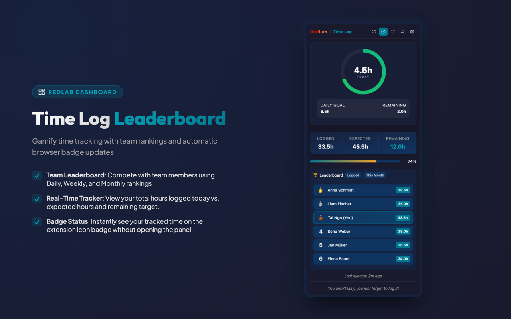
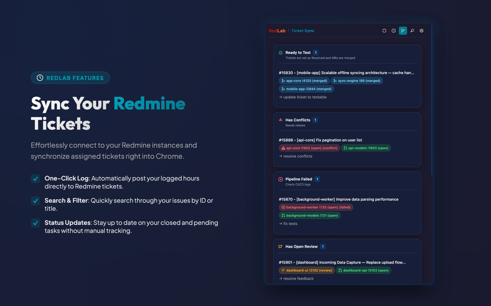

# RedLab

> *You aren't lazy, you just forget to log it!*

Chrome side panel for teams that use **Redmine** and **GitLab**.

Track logged hours, see the team leaderboard, and match resolved Redmine tickets to GitLab merge requests — plus local OTP codes you can fill into the page.

<p align="center">
  <a href="https://chromewebstore.google.com/detail/redlab/pimegpjllpdeeflnmfgkkoleobfncbjb">
    
  </a>
</p>

<p align="center">
  
</p>

<p align="center">
  
</p>

**Chrome Web Store:** [RedLab](https://chromewebstore.google.com/detail/redlab/pimegpjllpdeeflnmfgkkoleobfncbjb)  
**Privacy policy:** [pitogram.cc/policies/privacy](https://pitogram.cc/policies/privacy)

## Who this is for

You log time in **Redmine** and merge code in **GitLab**. RedLab is a Chrome extension that keeps both in one side panel.

| Platform | What RedLab uses it for |
|----------|-------------------------|
| **Redmine** | Logged hours, expected/remaining, leaderboards, resolved tickets |
| **GitLab** | Ticket Sync (merge request status, conflicts, pipelines, review feedback) |

## What it does

- **Time tracking and leaderboard** — Logged vs expected vs remaining hours, progress bar, period filters (today / week / month / history ranges)
- **Chrome badge** — Hours on the extension icon (logged or remaining, per settings)
- **Ticket Sync** — Resolved Redmine tickets matched to GitLab merge requests; groups for ready / conflicts / failed CI / open review / open to merge / draft
- **OTP** — Local TOTP codes. Set a page input as the target, then Fill writes the current code (copy-on-click still works)
- **Settings** — Redmine URL + API key, GitLab URL + token, hours-per-day, badge/ranking display, settings import/export
- **Local-only credentials** — Keys stay in Chrome storage; calls go only to your configured hosts

## Install

**From the store (recommended):**  
[chromewebstore.google.com/detail/redlab/pimegpjllpdeeflnmfgkkoleobfncbjb](https://chromewebstore.google.com/detail/redlab/pimegpjllpdeeflnmfgkkoleobfncbjb)

### Developer (from source)

```bash
git clone https://github.com/TaiNgo6798/redlab.git
cd redlab
npm install
npm run build
```

1. Open `chrome://extensions`
2. Enable **Developer mode**
3. **Load unpacked** → select the `dist/` folder

## Setup

1. Open the RedLab side panel
2. Open **Settings**
3. **Redmine:** base URL (no trailing slash) + API key
4. **GitLab (Ticket Sync):** base URL + personal access token
5. Set hours per day and badge preferences
6. Fields save on blur

Use any Redmine host and any GitLab host. There is no company-specific default.

## Development

```bash
npm run build        # production build → dist/
npm run dev          # watch rebuild
npm run type-check
npm run test
npm run lint
npm run lint:fix
```

| Hook | Behavior |
|------|----------|
| pre-commit | version bump (`npm run bump`) + sync `manifest.json` |
| pre-push | `npm run lint` |

## Tech stack

| Layer | Choice |
|-------|--------|
| Language | TypeScript |
| UI | React 19, Ant Design |
| Build | Vite 7 + CRXJS (Manifest V3) |
| Styles | Tailwind CSS 4, custom dark theme |
| Quality | ESLint 9, Vitest, Husky |

## Architecture (short)

```
sidepanel  ──messages──▶  background service worker  ──▶  Redmine / GitLab APIs
     │                            │
     ▼                            ▼
 chrome.storage.sync         chrome.storage.local
 (settings)                  (cached stats / ticket groups)
```

- **background.ts** — alarms, badge, API proxy, ticket-sync notifications
- **sidepanel/** — overview, settings, OTP, ticket-sync views
- **utils/api.ts** — Redmine + GitLab HTTP
- **utils/ticketSyncEngine.ts** — resolve tickets ↔ MRs and group evaluation

## Privacy

Credentials and caches stay on your device. See the [privacy policy](https://pitogram.cc/policies/privacy).

## License

MIT
